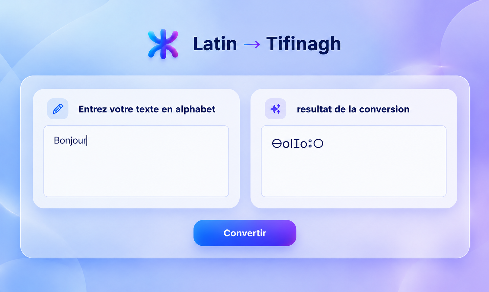

# Tifinagh Converter

Tifinagh Converter est une petite application web permettant de convertir un texte écrit en alphabet latin vers l’alphabet tifinagh.

Le projet utilise **Python** pour la logique de conversion et **Flask** pour l’interface web.



## Fonctionnalités

- Conversion d’un texte latin vers le tifinagh
- Interface web simple et responsive
- Gestion des caractères spéciaux et des accents
- Affichage direct du résultat
- Architecture légère avec Flask

## Technologies utilisées

- Python
- Flask
- HTML5
- CSS3

## Structure du projet

```text
tifinagh-converter/
│
├── app.py
├── converter.py
├── .gitignore
│
├── templates/
│   └── index.html
│
└── static/
    ├── css/
    │   └── style.css
    │
    └── images/
        └── z.png
